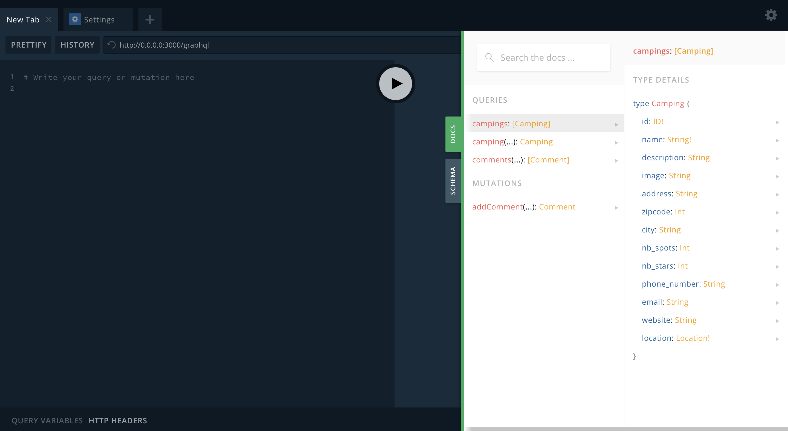
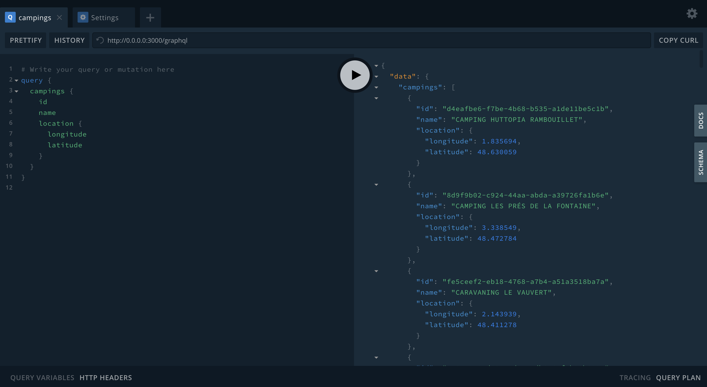
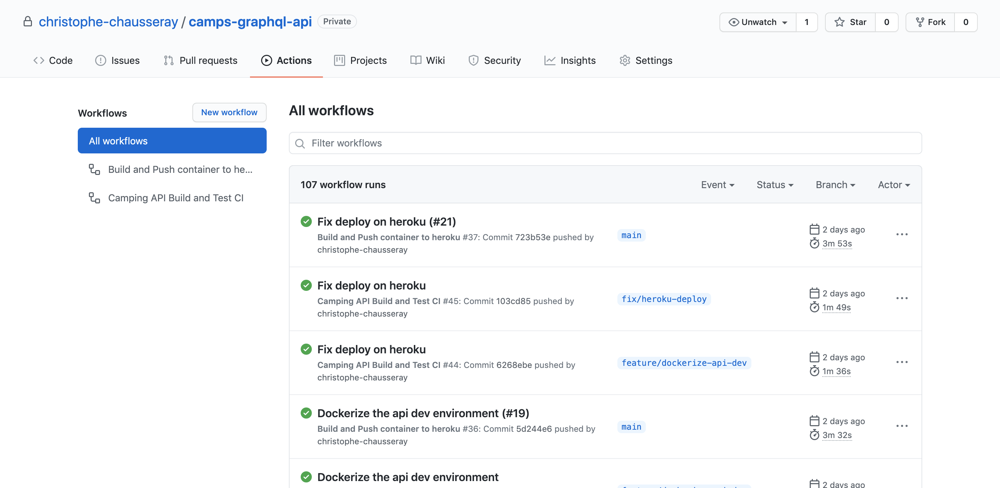

<h3 align="center">
  Camps API
</h3>

<p align="center">
  <a href="https://nodejs.org/en/">NodeJs</a>
  <a href="https://graphql.org/">GraphQL API</a>
  applying <a href="https://martinfowler.com/bliki/CQRS.html">CQRS</a> and
  <a href="https://en.wikipedia.org/wiki/Domain-driven_design">DDD</a> patterns,
  built with <a href="https://en.wikipedia.org/wiki/Continuous_integration">CI</a>.
</p>

> The goal of this GraphQL API is get the location and all the details and comments of campings.
> You can have access to the API here [camps-api.herokuapp.com/graphql](https://camps-api.herokuapp.com/graphql)

<p align="center">
  <a href="#getting-started">Getting Started</a> •
  <a href="#queries-mutations">Queries and Mutations</a> •
  <a href="#built-with">Built With</a> •
  <a href="#tests">Tests</a> •
  <a href="#coding-standard">Coding Standard</a> •
  <a href="#ci-and-deployment">CI and Deployment</a> •
  <a href="#license">License</a>
</p>

## <a name="getting-started"></a> Getting Started
### Prerequisites

To install and run the API you need only [Docker Compose](https://docs.docker.com/compose/).
Please follow the [official documentation](https://docs.docker.com/compose/install) to install it on your environment.

### Installation
Clone the project and run the default installation:

```bash
git clone https://github.com/christophe-chausseray/camps-graphql-api.git
cd camps-api
make up
```
Your docker containers should have been successfully built and run the api directly.

You can go now access to your local GraphQL Playground on [http://0.0.0.0:3000/graphql](http://0.0.0.0:3000/graphql) to test the API.

You can also uninstall the application with :
```bash
make down
```
It will stop and unmount the docker containers.

## <a name="queries-mutations"></a> Queries and Mutations

With the Camps API, you can make queries and mutations to :
- **Get a list of campings**
- **Get the information details of one camping**
- **Get a list of comments for a camping**
- **Add a new comment for  a camping**

You can get all the information about how to make those queries and mutation in the section Docs and Schema of your GraphQL Playground.



### Query Example

I would like to get the list of campings with the id, name and location (longitude / latitude) of each one.



## <a name="built-with"></a> Built with

- [NodeJS](https://nodejs.org/en/)
- [PostgreSQL](https://www.postgresql.org/)
- [Apollo Server](https://www.apollographql.com/docs/apollo-server/)
- [Docker](https://www.docker.com/)

## <a name="tests"></a> Tests

This API is automated tested following the [Test Pyramid](https://martinfowler.com/articles/practical-test-pyramid.html) : Unit tests, Integration tests and End-to-End tests.

Those tests can be run with :
```bash
make test
```
## <a name="coding-standard"></a> Coding Standard

### Domain Driven Design

Code and folder structure follow [Domain Driven Design principle](https://martinfowler.com/bliki/DomainDrivenDesign.html) and [Hexgonal architecture](https://herbertograca.com/2019/06/05/reflecting-architecture-and-domain-in-code/).

    src
        \
            |\ Application     `Contains handlers to handle the use-cases apply on the Domain. It adapts the request from the Infrastructure layer to the Domain layer.`
            |
            |\ Domain          `The system business logic layer (Read / Write Models, Value Objects, Exceptions)`
            |
            |\ Infrastructure  `It contains the code which communicating with third-party libraries and used by the application.(Persistence, Query, API Request etc)`

### Command Query Responsibility Segregation

In this project, I used the principle of [CQRS](https://martinfowler.com/bliki/CQRS.html#:~:text=CQRS%20stands%20for%20Command%20Query,you%20use%20to%20read%20information.) to **separate the information we read from the system and the information we write in the system**.

For exemple, when the user would like to list the comments for a camping the system will use a **query handler** which will return one **read model**.
Whereas, when the user would like to add a comment for this camping the system will use a **command handler** which will create a **write model** before to persist it in DB.

## <a name="ci-and-deployment"></a> CI and Deployment

This project handles the CI and deployment with [Github Actions](https://github.com/features/actions) on [Heroku](https://www.heroku.com/).



The build and deploy workflows can be found in the `.github/workflows/` directory.

The CI build will be run on the branch following the pattern `feature/**` or `fix/**`.
It will execute the linter and the test to check if the code is following the coding style of the application and if it doesn't break anything.

## <a name="license"></a> License

[MIT](https://opensource.org/licenses/MIT)

> Christophe Chausseray &nbsp;&middot;&nbsp;
> [Linkedin](https://www.linkedin.com/in/christophe-chausseray-10672140/)


